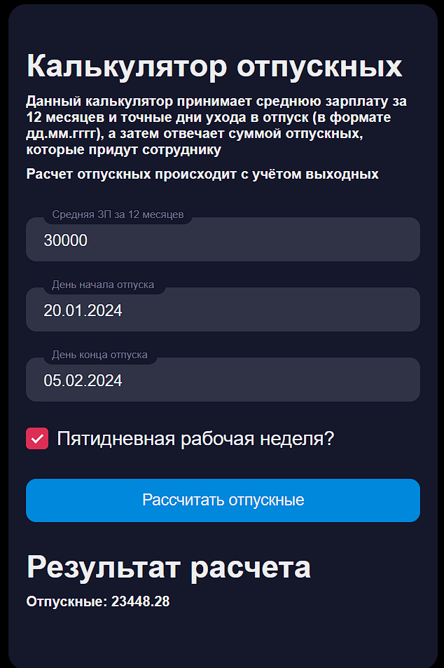

# Тестовое задание Neoflex "Калькулятор отпускных" (frontend)

## Требования к приложению

Микросервис на SpringBoot + Java 11 c одним API:
GET "/calculate"

Минимальные требования: Приложение принимает твою среднюю зарплату за 12 месяцев и количество 
дней отпуска - отвечает суммой отпускных, которые придут сотруднику.

Доп. задание: При запросе также можно указать точные дни ухода в отпуск, 
тогда должен проводиться рассчет отпускных с учётом праздников и выходных.

Проверяться будет чистота кода, структура проекта, название полей\классов, 
правильность использования паттернов. Желательно написание юнит-тестов, проверяющих расчет.

## Было реализовано

Калькулятор принимает среднюю зарплату за 12 месяцев и точные дни ухода в отпуск,
а затем отвечает суммой отпускных, которые придут сотруднику. Расчет отпускных происходит с учётом выходных.

## Скриншоты

Экран с формой:

Экран с формой после вывода результата:

## Backend
[Ссылка на репозиторий с Backend](https://github.com/Babkina-Ekaterina/holiday-pay-calculator-backend)